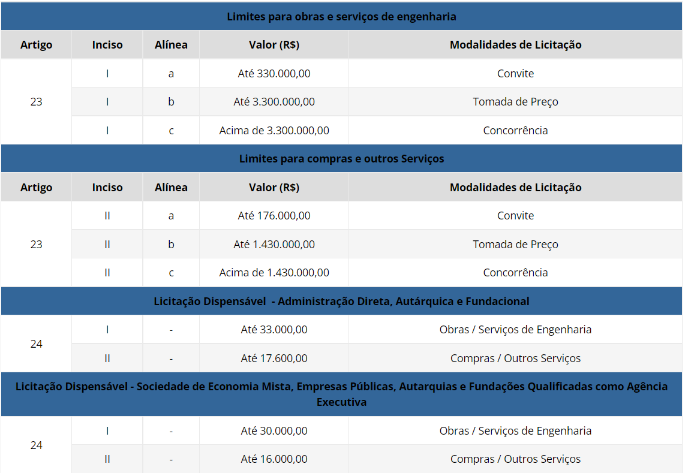
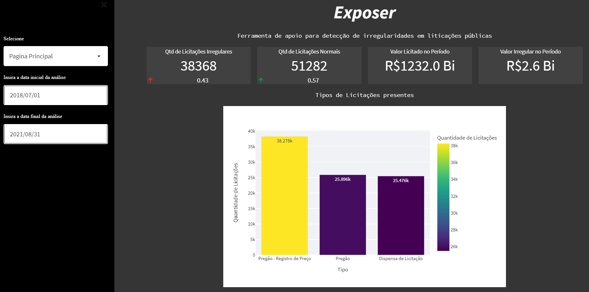
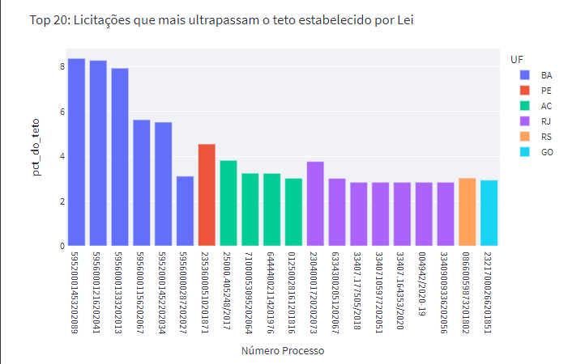
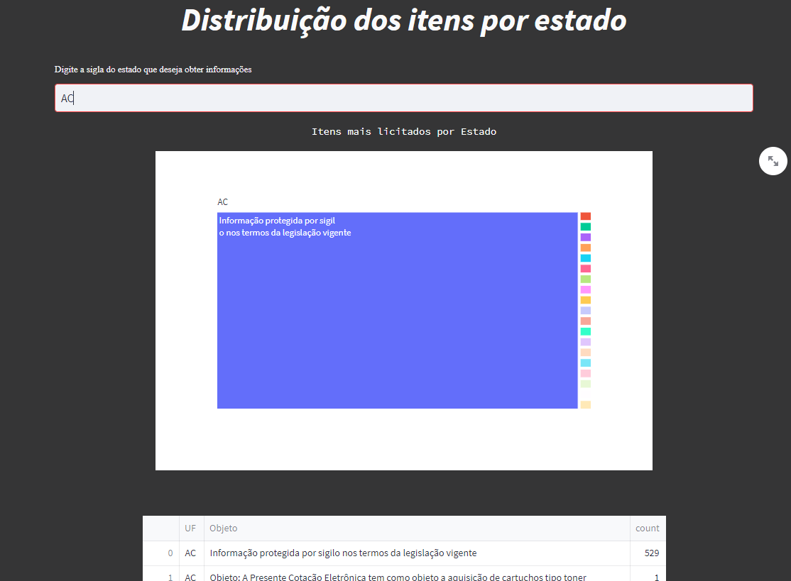
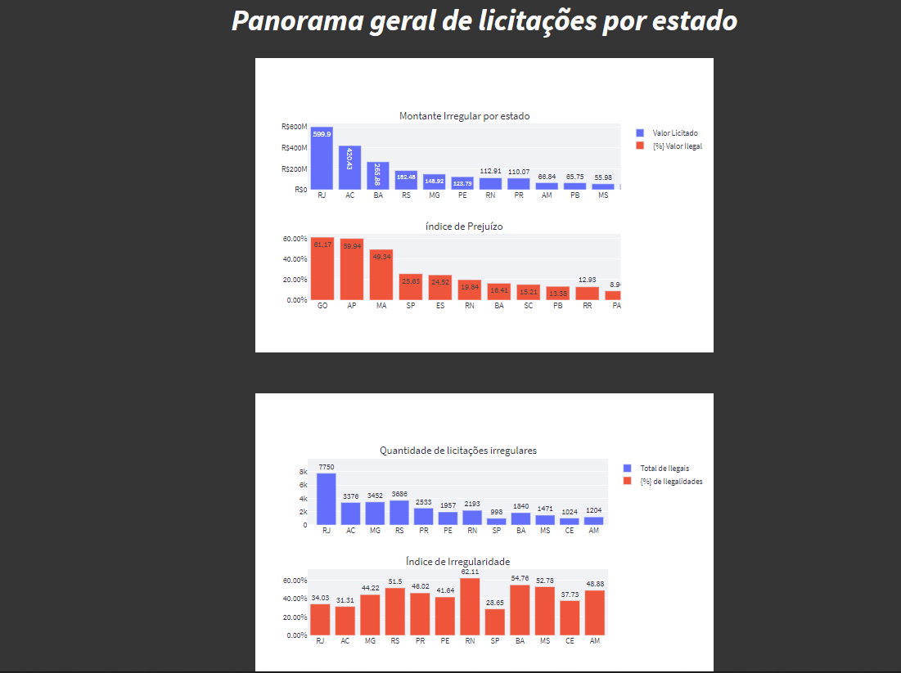
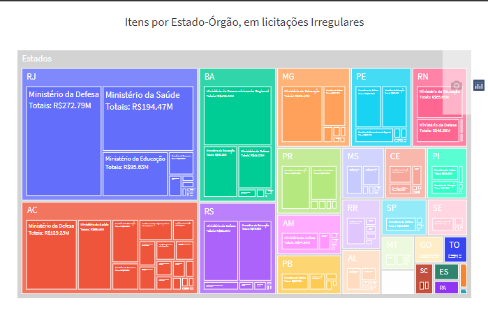

Repositório para organização dos artefatos criados e utilizados durante o desenvolvimento do Projeto de Licitação e Contratos para o Curso de Especialização em Engenharia e Ciência de Dados promovido pela e Samsung e Sidi

# `Detalhamento do Exposer:`

## Introdução

Licitações Públicas: São processos pelos quais as instituições públicas realziam compras e contratam serviços. Nelas, são propostas pelas entidades governamentais o que se deseja comprar, e empresas privadas podem participar dos pleitos, apresentando suas propostas e valores correspondentes. Para saber mais sobre os tipos de licitações, deixamos o link: https://www.portaltransparencia.gov.br/entenda-a-gestao-publica/licitacoes-e-contratacoes.
A tabela a seguir, mostra os tetos e pisos estabelecidos por lei para cada tipo de compra:

## Tela inicial

Aqui, são apresentadas informações gerais acerca do recorde dos dados selecionado pelo usuário na barra lateral esquerda, tais como: tipos mais comuns de licitações; quantidade daquelas que foram etiquetadas como ilegais ou não, pela ferramenta; valores licitados licitamente, etc.

## Tela 02

Aqui são apresentados para o usuário, algumas listas de rankings calculados. A primeira revela, as licitações que mais ultrapassaram o teto permitido para modalidade a qual pertencem. Por exemplo, se o teto para uma modalidade é R$17.500 e o valor licitado foi de R$170.000, será exibido que ela ultrapassa o teto em 10x.

Ainda na presente página, é possível ver a lista das 10 empresas Top Winners e Top Losers do período.

## Tela 03

Nela são exibidos os itens mais comprados no estado de desejo, sendo apresentado em forma de gráfico e tabela.

## Tela 04

Exibe o índice de irreguraridade, que revela o percentual do total de licitaçoes que está fora dos limites legais; e o índice prejuízo monetário, descreve o percentual do montante licitado que é irregular.

Em seguida é mostrado um treemap que revela todos os gastos, tidos como irregulares, por estado e também segmentado por órgão regulador para o qual foi solicitada a verba

